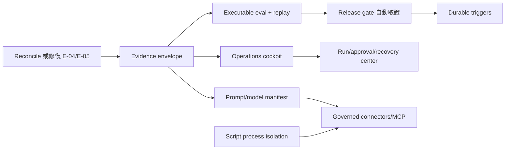

# Agent Architecture 改善總覽

> 狀態：研究與規劃完成，尚未排入實作。  
> 外部參考：[hardness1020/awesome-agent-architecture](https://github.com/hardness1020/awesome-agent-architecture)（00–21 章）。  
> 本文件是比較與決策入口；逐章證據見 [01-section-comparison.md](01-section-comparison.md)，可交付計畫見本資料夾其餘文件。

## 1. 結論

SpringAITest 不需要再建立一個通用 agent loop。現有 D1–D7 與 E1/E3 已在多租戶 authority、immutable snapshot、durable command、lease fencing、checkpoint、approval、once-only effect、context provenance 與 bounded orchestration 上，超過外部 repo 的教學型實作。

值得採用的不是它的 miniature runtime，而是它用來檢查 harness 完整性的 22 個視角。套用後，真正缺口集中在四個可獨立交付的面向：

1. **Evaluation 與 observability 閉環**：已有 redacted events、OTel/Langfuse、aggregate metrics 與 release gate，但沒有可執行、版本化、可比較、直接供 gate 消費的 eval runner。
2. **Prompt、model 與 runtime policy**：Agent prompt 已 revisioned；legacy chat 的 guard/router/summary/persona 與 model fallback 還不是可 pin、可比較、可 rollback 的 artifact。
3. **Operations 與 durable trigger**：runtime 已 durable，但跨 run 發現、approval inbox、release cockpit、recovery operations 與 schedule/webhook trigger 尚未成為完整產品能力。
4. **Extension security**：native tools 的 authority boundary 很強；custom script 仍是同程序的非惡意 sandbox，MCP/connector 則尚無 governed lifecycle。

這四個面向分別由以下計畫處理：

| 計畫                                                                       | 優先級 | 核心交付                                                                           |
| -------------------------------------------------------------------------- | ------ | ---------------------------------------------------------------------------------- |
| [02-evaluation-observability-plan.md](02-evaluation-observability-plan.md) | P0     | evidence envelope、versioned eval、controlled replay、release gate closure         |
| [03-prompt-model-runtime-plan.md](03-prompt-model-runtime-plan.md)         | P0/P1  | prompt manifest、model policy、context/memory provenance                           |
| [04-operations-trigger-plan.md](04-operations-trigger-plan.md)             | P0–P2  | runs/tasks center、approval discovery、release cockpit、recovery、durable triggers |
| [05-extension-security-plan.md](05-extension-security-plan.md)             | P0/P2  | script process isolation、governed connector/MCP boundary                          |

### 文件導覽

- 本文件：研究結論、共同原則、優先順序與 non-adoption decisions。
- [01-section-comparison.md](01-section-comparison.md)：外部 00–21 章逐項 disposition 與本地 authority。
- [02-evaluation-observability-plan.md](02-evaluation-observability-plan.md)：先完成 Gate E0/evidence，再建立 eval-to-release 閉環。
- [03-prompt-model-runtime-plan.md](03-prompt-model-runtime-plan.md)：依賴 evidence identity，可與 operations UI 並行。
- [04-operations-trigger-plan.md](04-operations-trigger-plan.md)：先交付可見性/recovery，trigger 等 P0 gates 完成後才啟動。
- [05-extension-security-plan.md](05-extension-security-plan.md)：script isolation 是 P0；connector/MCP 是需求驅動的 P2。
- [06-cleanup-and-consolidation.md](06-cleanup-and-consolidation.md)：跨計畫 cleanup 順序與 deletion gates。

## 2. 比較方法與限制

外部 repo 是把常見 coding-agent harness 機制拆成可執行小範例的教學材料。它混合公開行為、開源片段、逆向觀察與簡化實作，不是單一 production architecture，也不是成熟度標準。因此本次比較採三類判定：

- **採用原則**：可改善本系統既有 production boundary，且不另造 authority source。
- **已被現況超越**：本系統已有更 durable、governed 或 multi-tenant 的實作，只補操作與證據閉環。
- **不採用**：coding-agent 特有或會弱化現有 server-owned policy 的機制。

比較證據來自現行 contracts、plans、runtime、tests 與四個獨立 SubAgent 審查（workflow、.NET/authority、frontend/operator、security/reliability）。沒有把外部 repo 的 README 宣稱當成本地需求，也沒有因「缺少同名元件」就判定為缺陷。

## 3. 現有優勢，必須保留

### 3.1 Authority 與 durability

- Backend 持有 draft/revision/run/command/lease/approval/effect/context 的 durable authority。
- Workflow 只執行 Backend 發行且 hash 驗證成功的 artifact，不自行創造 identity、ownership 或 grant。
- D3/D5 使用 immutable snapshots、generation-fenced claims、checkpoint 與 restart recovery。
- D7 把 write effects 放在 durable approval、effect identity、transactional evidence/outbox 之後。
- E1/E3 context 使用 policy-evaluated revisions、evidence pins、role views 與 task-local lineage。

任何新 eval、trigger、connector 或 UI 都必須重用這些 authority，不得建立第二套 run、permission、approval、trace 或 scheduler-owned execution state。

### 3.2 Bounded autonomy

現行 Root/child runtime 已有 step/tool/token/time/concurrency budget、independent verifier、bounded repair、cascade cancellation 與 PASS-only aggregation。這比開放式 peer coordination 或「讓模型自行決定何時結束」更適合 governed business agents。

### 3.3 已有 observability 與 rollout 基礎

- Runtime events 已有 stable ID、redaction 與 cursor semantics。
- OTel/Langfuse 已提供診斷 traces。
- Operations governance 已聚合 Agent/Skill/tool/node usage、cost 與 latency。
- Regression ledger、audited override 與 future-roots-only rollout 已存在。

缺口是把這些能力接成可執行 improvement loop，而不是新增第三個 telemetry 或 rollout 系統。

## 4. 已確認的風險與事實落差

### 4.1 Release evidence 狀態互相矛盾

[../copilot-shared-core/05-release-evidence-plan.md](../copilot-shared-core/05-release-evidence-plan.md) 仍明確記錄 release blocked：E-04 authenticated mem0 recall 與 E-05 routing/answer fidelity 失敗；[../agent-platform-redesign/01-plan.md](../agent-platform-redesign/01-plan.md) 的 D6 delivery row 則記錄較新的 PASS bundle，但該 bundle 不在目前 workspace。新計畫不得選擇方便的一邊：先依 manifest、artifact、runner output 與 secret scan reconciliation，更新單一 evidence record；完成前 Gate E0 fail closed，deterministic lane PASS 不能取代 production sign-off。

### 4.2 Eval contract 有了，runner 還沒有

[../chat-skill-routing/04-acceptance-test.md](../chat-skill-routing/04-acceptance-test.md) 的 `CSR-EVAL-001` 已定義固定、去識別化 routing corpus。Operations API 目前記錄 caller 提供的 pass/evidence，而不是執行或驗證 eval。應擴充既有 contract 與 gate，不能另建一套互不相容的 quality ledger。

### 4.3 Production recovery check 非 mandatory lane

PostgreSQL checkpoint/HMAC/reopen 測試已人工以真實 DSN 跑過並通過，但 repo 沒有 CI，預設測試仍會 skip。計畫應建立明確 release validation lane，而不是宣稱現有自動化已覆蓋 production checkpointer。

### 4.4 Script sandbox 不是 security boundary

`workflow/app/engine/script_runner.py` 已誠實記載 v1 限制：namespace default-deny 且 script 無法讀取 `INTERNAL_API_TOKEN`/DB URL/env（`:574-582` 白名單設計、`:209-211` AST analyzer），但目前可證實的暴露是同程序資源耗盡（CPU 與 memory 炸彈可拖垮整個 Workflow worker；docstring `:7-15` 自承中間配置無上限、`MAX_ITERATIONS` 只界定圈數不界定量級、`MAX_WRITE_BYTES` 只檢查寫回值不管中間配置）。「同程序」的 secret 風險需先假設 AST analyzer 有洞才成立，是次級而非首要理由。這對 trusted ADMIN authoring 可接受，但不能延伸成 untrusted package/plugin/MCP execution boundary。

### 4.5 Plan index 已同步，歷史狀態仍需 reconciliation

本次已把 `plans/README.md` 的 Agent Platform summary 同步為 D1–D7 code/contracts delivered、R6 cleanup pending；D6 real-model release sign-off 仍依 4.1 的 evidence reconciliation，不因 delivery map 更新而自動成立。

## 5. 明確不採用

| 外部模式                      | 決策   | 原因                                                                                                       |
| ----------------------------- | ------ | ---------------------------------------------------------------------------------------------------------- |
| 任意 lifecycle hooks          | 不採用 | 會讓 extension code 繞過 server-owned policy；只接受 typed、versioned、allowlisted provider boundary。     |
| Session-local todo/plan store | 不採用 | D5 durable root/child ledger 已是 execution authority；todo 只適合 coding session UX。                     |
| Workflow cron/scheduler       | 不採用 | trigger definition/fire ledger 應由 Backend 持有，fire 只建立正常 immutable root。                         |
| Workflow 直接連 MCP           | 不採用 | credentials、server identity、discovery 與 revocation 必須由 Backend governed connector revision 管理。    |
| Peer-to-peer/open autonomy    | 不採用 | 保留 Root-issued artifacts、budget、verifier independence 與 PASS-only aggregation。                       |
| Git worktree isolation        | 不適用 | runtime 操作 immutable database artifacts，不修改 source tree；若未來產品真的執行 code change 再另立需求。 |
| 第二套 trace/replay store     | 不採用 | durable evidence identity 延伸既有 events/telemetry；Langfuse 保持診斷視圖。                               |
| 第二套 MCP permission model   | 不採用 | 直接重用 grants、tool risk、business rules、D7 approval 與 effect identity。                               |

## 6. 共同交付原則

1. **先量測後擴權**：P0 先完成 evidence/eval 與 script isolation；scheduling、MCP 等擴張能力不得先行。
2. **Backend authority**：definitions、revisions、release state、credentials references、trigger fires 與 eval results 都由 Backend durable 持有。
3. **Workflow execution only**：Workflow 驗證與執行 pinned artifacts；不成為新的 catalog、scheduler 或 secret authority。
4. **Fail closed**：新能力有獨立 feature flag、tenant allowlist、exact capability 與 kill switch；disabled 在 auth 前按既有規範隱藏。
5. **Active runs 不變**：policy、prompt、connector 或 rollout 更新只影響 future roots；已接受 run 保留 snapshot。
6. **Safe projections**：browser 只見 hashes、revision、server-authored summary、usage/cost、redaction reason；不見 raw prompt/context/tool args、lease/checkpoint/effect/credentials。
7. **No release by assertion**：release gate 只接受由 versioned runner 產生且可驗證的 result identity；人工 override 仍需 reason、capability、idempotency 與 audit。

## 7. 建議順序

P0 完成條件是：現有 evidence contradiction 已消除、每個新 run 有可對帳 evidence identity、eval result 可供既有 gate 驗證、script 不再與 Workflow secrets 共程序。Durable triggers 與 MCP 屬後續產品能力，不應混入 P0 的可靠性修復。

## 8. 整體成功條件

- 同一個 completed D3/D5 run 可由 stable IDs 重建 redacted event、snapshot/prompt/context/model/tool revisions、usage/cost/latency、verdict 與 release evidence lineage。
- 固定 dataset、recorded replay 與 live shadow 三種 eval 不產生 production side effects，結果可比較且能驅動現有 regression gate。
- Operator 不知道 run ID 也能找到授權範圍內的 active/recent work 與 pending approvals；跨 tenant/owner 資料仍 fail closed。
- Prompt/model/connector/trigger 的更新只影響 future roots，active runs 不漂移。
- 任一 scheduled/webhook occurrence 至多建立一個 root；任一 connector tool call 仍受現有 grant/rule/risk/approval/effect 邊界。
- 關閉任一新 feature flag 不破壞既有 chat、D3/D5 run、native tool、automatic recovery 或 audit history。

## 9. Cleanup inventory

完成全部計畫後才評估刪除，且每項需先以 usage/evidence 證明無 caller：

- Prompt artifact cutover 後，移除重複的 hard-coded copilot/guard/routing/summary defaults；fallback 期間保持 byte-for-byte 相容。
- Operations telemetry 成為 authoritative 後，以 evidence-derived inventory 取代 compile-time legacy inventory。
- Unified Runs center 穩定後，讓 Agent/Orchestrator test consoles 共用同一 trace projection，刪除重複 polling/trace formatting，不刪 authoring-specific controls。
- Script subprocess rollout 完成後，刪除 in-process execution path；保留 AST analyzer 作為第一道靜態 guard。
- Connector catalog 上線後，native tools 仍保留；不得為統一外觀而把已驗證的 native path 強制繞遠路。

Immutable revisions、run snapshots、approval/effect ledgers、context evidence 與 eval results 都是 audit records，不是 cleanup 對象。