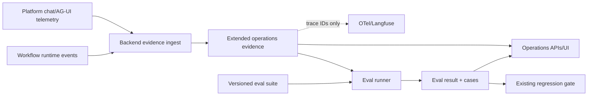

# Evaluation 與 Observability 閉環計畫

> 優先級：P0。  
> 交付狀態：Phase E0/E1/E2/E3 已實作（2026-07-30）；Phase E4 部分交付（eval suites/runs UI；operations productization 其餘項目未實作）。  
> 目標：重用既有 events、OTel/Langfuse、operations metrics、`CSR-EVAL-001` 與 regression gate，建立可執行且可稽核的 improvement loop。

## 1. 問題

目前可以看見 aggregate usage/cost/latency，也可以人工記錄 regression PASS/FAIL，但 release gate 無法證明結果是由哪個 dataset、candidate、model/config、runner 與 case results 算出。Shared-core E-04/E-05 仍失敗；PostgreSQL production checks 也不是預設 release lane。

最小正確改動不是新增 dashboard-only score，而是讓每個 run 與 eval 都有 stable evidence identity，並讓既有 gate 驗證該 identity。

## 2. Authority 與資料流

- Backend：suite/revision、run/result/cases、extended operations evidence 與 release eligibility 的唯一 authority。
- Workflow：執行 deterministic/live eval candidate，不保存 release state。
- Platform：提供 chat/AG-UI evidence，不能自行宣告 PASS。
- Langfuse/OTel：診斷視圖，不是 durable release authority。實際接線：Platform 端在 `platform/src/Platform.Web/Platform.Web.csproj:16-19` 的四個 OpenTelemetry 套件 + `Program.cs` 讀 `LANGFUSE_OTEL_ENDPOINT`/`OTEL_MODE` env 驅動；Workflow 端在 `workflow/pyproject.toml:16` 的 `langfuse>=3.0` + `workflow/app/tracing.py`（`LANGFUSE_ENABLED` 開關）。

## 3. Phase E0：先消除現有矛盾

1. Reconcile shared-core evidence：D6 delivery row 記載較新的 E-04/E-05 PASS，但 canonical evidence record 仍是 FAIL，且目前 workspace 找不到該 PASS bundle。以 runner manifest、artifact identity、case results 與 secret scan 判定，不能只改文字。
2. 若 PASS bundle 無法驗證，修復 E-04 mem0 recall 與 E-05 routing/answer fidelity，再重跑同一組最新 E-01–E-06 bundle；不得拼接不同時間的局部 PASS。
3. 把真 PostgreSQL checkpoint/HMAC/reopen tests 納入明確 release command/evidence profile。
4. 修正 document consumer unexpected failure：transient bounded requeue，terminal poison durable failed + DLQ；不得無條件 ACK 遺失。

**Gate E0**：上述 evidence 文件改為全綠前，不宣稱 production release-ready。

## 4. Phase E1：Run evidence envelope

擴充既有 `operations_execution_metric`/operations telemetry authority，而非平行建立第二套 usage/cost ledger。既有主鍵 `(tenant_id, run_id, event_id)`（`backend/src/Backend.Api/Data/DbBootstrap.cs:511`）與 `ON CONFLICT(tenant_id,run_id,event_id) DO NOTHING`（`backend/src/Backend.Api/OperationsGovernance/OperationsGovernanceRepository.cs:103`）已提供 event-ID idempotency 與 tenant/run 歸屬檢查；E1 是擴充欄位與來源，不是新建 ledger。由 Backend durable run events/outbox 派生；Platform/Workflow 無法與本地 run event transactionally commit 的 telemetry，透過 producer outbox 投遞。為 model/tool/node/run completion 建立 append-only、tenant-scoped、event-ID-idempotent envelope：

- root/run/child IDs、event ID、timestamp、outcome/error class。
- immutable snapshot SHA、Agent/Orchestrator/Skill revisions。
- prompt manifest SHA、context revision/role-view identity、policy revision。
- model provider/deployment/resolved model ID、可取得時的 fingerprint、settings hash。
- tool/connector revision、node ID、trace/span IDs。
- reserved budget、observed usage/cost/latency，並區分 measured/estimated/unknown。
- verifier/case verdict 與 redaction metadata。

禁止保存 raw prompt、context body、memory fact、tool arguments/results、JWT、credentials 或 hidden chain-of-thought。

**驗收**：

- Duplicate event ID replay 不重複計費或增加 count。
- Tenant/run/snapshot mismatch fail closed。
- 每個 completed D3/D5 root 可對帳 reserved vs observed；缺 usage 顯示 unknown，不當成 0。
- Evidence ingest 失敗不得改變 execution outcome；source event/outbox 必須讓 bounded retry、lag metric 與 durable gap status 可重建。
- Dual-write 期間逐 event reconcile 既有 metric 與 extended envelope；usage/cost 不得有兩個 authority。

## 5. Phase E2：Versioned eval 與 controlled replay

### 5.1 Reuse first

- 將 `CSR-EVAL-001` 升為第一個 durable suite revision，不另建 competing routing corpus。
- Shared-core E-01–E-06 保留為 release evidence profile，可引用 eval result identity。
- 既有 business-rule golden tests 與 verifier contracts 作為 deterministic checks，不轉成 prompt judge。

### 5.2 三種執行模式

1. **Deterministic fixture**：固定 tools/rules/model fixtures，適合 routing、schema、redaction、policy 與 recovery。
2. **Recorded response replay**：重播已去識別 model/tool responses，驗證 harness/prompt parser/runtime regression。
3. **Live shadow**：使用真模型比較 candidate，但所有 write/mem0/conversation/outbox/approval effects 關閉，另有 budget/rate limit。

### 5.3 結果模型

每個 result pin suite revision、candidate snapshot/prompt/model policy、baseline、runner version、started/completed time、case verdict、metric、failure reason 與 evidence envelope IDs。Judge 若使用模型，必須 pin evaluator model 且不得與被測 verifier 混為同一 identity。

**驗收**：

- Replay 不能建立 approval、effect、outbox、conversation、mem0 write 或 production run。
- 相同 deterministic inputs 產生相同 canonical case identity 與 verdict。
- Live shadow failure 不影響 production response；成本可獨立封頂與停止。
- Case-level output contract、routing、grounding、verifier、latency、usage、cost 可比較 baseline/candidate。

## 6. Phase E3：Release gate closure

調整既有 regression write contract：gate 不再信任 caller 提供的布林值，而是接收 Backend 可驗證的 completed eval result ID。Backend 依 suite policy、required cases、threshold、freshness、candidate identity 算出 gate。

人工 override 保留，但必須 exact capability、reason、idempotency key、actor、expiry/target 與 audit。Rollout 仍只影響 future roots，active snapshot 不變。

## 7. Phase E4：Operations productization

- Aggregate cards：runs、success/failure、latency、usage/cost、unknown usage、verifier rejection、repair、write effects。
- Agent/Skill/tool/node tables 與 revision comparison。
- Eval suites/runs/cases、baseline/candidate delta、failed-case drill-down。
- Release gate、evidence freshness、override、canary rollout/rollback controls。
- Per-run redacted timeline 以 evidence IDs 關聯 Langfuse trace，不嵌 raw trace payload。

前端重用 `apiFetch`、現有 AppShell/CSS/confirm/toast patterns；不新增 router 或 UI dependency。

## 8. Flags 與 rollout

| Flag                       | 預設  | Rollout                                                 |
| -------------------------- | ----- | ------------------------------------------------------- |
| `RUN_EVIDENCE_ENABLED`     | false | dual-write → reconciliation read-shadow → authoritative |
| `RUN_EVAL_ENABLED`         | false | deterministic suites first                              |
| `LIVE_SHADOW_EVAL_ENABLED` | false | tenant/model allowlist + independent budget             |

關閉 evidence/eval 只停止新寫入/執行，不影響正常 runtime 與既有 audit records。Gate 在 required evidence 缺席時 fail closed。

## 9. 驗證

- Backend repository/controller tests：tenant isolation、idempotency、freshness、threshold、override、future-roots-only。
- Workflow tests：side-effect-free replay、runner pinning、deterministic identity、live budget cancellation。
- Platform tests：chat/AG-UI envelope parity 與 secret/redaction matrix。
- PostgreSQL integration：crash-before-send、send-after-commit、duplicate delivery、root/child reconciliation、reopen/recovery、HMAC/checkpoint suite mandatory evidence lane。
- E2E：failed eval blocks rollout；audited override allows only intended target；active roots retain old snapshot。

## 10. Cleanup inventory

- Extended operations evidence authoritative 後，以它取代 compile-time legacy inventory；先 shadow compare 再刪常數清單。
- Eval gate cutover 後，移除 caller-supplied `passed` contract；保留歷史 regression records 做 audit migration。
- 共用 run evidence projection 後，刪除各 UI 重複的 raw JSON formatting，不刪 OTel/Langfuse exporters。
- 不建立第二個 trace store；若 prototype 曾寫入 raw payload，migration 前先完成 secret scan 與 retention deletion。
