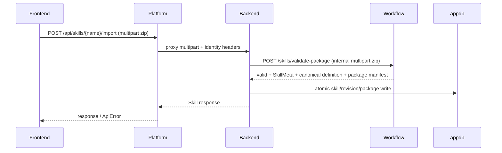

# 詳細設計 — Agent Skill 標準格式支援

> 狀態：**P0–P2 已交付；P3 延後。** 本檔保留為歷史設計；現況以程式碼與 AGENTS.md 為準。

## 1. 設計決策

| ID  | 決策                                                                                                      | 理由                                                                                         |
| --- | --------------------------------------------------------------------------------------------------------- | -------------------------------------------------------------------------------------------- |
| D1  | package validation 採 multipart，Backend 將 upload stream 轉送至 Workflow 的 internal validation endpoint | zip 是二進位資料；避免 JSON base64 膨脹與兩種 transport 並存                                 |
| D2  | Workflow 解析 `SKILL.md` 並回傳 canonical definition                                                      | 保持 Workflow 為 schema 唯一語意權威，Backend 不複製 parser                                  |
| D3  | Workflow invoke 經 tenant-scoped internal endpoint 按需取得 package                                       | 現行 custom loader 僅取得 `definition`；package 不進公開 JSON，也不做有風險的跨 tenant cache |
| D4  | agentic 在 compiler 內降為單一 `agent_skill_runner` node                                                  | 保留 compiler、Harness、audit 與 cache，不新建 orchestration runtime                         |
| D5  | LangChain tool adapter 只是一層轉接，所有 dispatch 回到 `tool_registry.invoke`                            | allowlist 與 trace 的既有 enforcement 不被繞過                                               |
| D6  | 現有 chat router 不拓寬 input 規則                                                                        | 避免 agentic feature 意外改變既有 deterministic routing 行為                                 |
| D7  | P1 runner 不執行 bundle scripts                                                                           | 外部 zip 的 script 不可在現有 in-process runner 上取得 production execution 能力             |
| D8  | P3 isolation runner 與 script protocol 獨立交付；gVisor 是候選而非先決實作                                | 先把安全結果與測試門檻定義清楚，再決定可部署的 Linux runtime                                 |

## 2. package 與資料流

### 2.1 公開匯入



公開 import 沿用 Skills 的 ADMIN authorization。Backend 在呼叫 Workflow 前只做 transport-safe 限制，例如 request content length；所有 archive 結構、frontmatter、tool 與 script scan 交由 Workflow。Workflow 在安全解壓後分派兩種格式：agentic 走 `SKILL.md` frontmatter parser；flow 只接受現有 exporter 的根目錄 `SKILL.md` 與 `skill.yaml`，以既有 YAML validator 驗證 `skill.yaml`，並將原始 `skill.yaml` bytes 作為 definition 寫回。flow metadata 由該 definition 的既有 validator 產生，且 name 必須等於 `expected_name`。

### 2.2 internal validate-package contract

新增 Workflow internal endpoint：`POST /skills/validate-package`。

Request 為 multipart：

- `package`: 必填 zip file。
- `expected_name`: 必填，等於公開 import route 的 `{name}`。
- identity headers：既有 `X-Internal-Token`、`X-Tenant-Id`、`X-User-Id`、`X-User-Role`。

成功回應是既有 validation response 的 internal superset：

```json
{
  "valid": true,
  "errors": [],
  "skill": {
    "name": "example_skill",
    "description": "Example skill",
    "required_role": "USER",
    "input_schema": {},
    "kind": "agentic"
  },
  "canonical_definition": "kind: agentic\n...\n",
  "package_manifest": {
    "entries": ["SKILL.md", "references/guide.md"],
    "sha256": "..."
  }
}
```

`canonical_definition` 僅在 internal validate-package response 出現，不擴張公開 validator contract。invalid response 維持 `{valid:false, errors:[...]}`，且不含可被寫入的 metadata/definition。

### 2.3 儲存模型

`skill` 新增 nullable `package bytea`；`skill_revision` 新增 nullable `package_sha256`。

| kind    | `definition`                                       | `package`      | revision hash                          |
| ------- | -------------------------------------------------- | -------------- | -------------------------------------- |
| flow    | 作者提交的 YAML 原文                               | NULL           | 現有 `definition_sha256`               |
| agentic | Workflow 從 frontmatter 產出的 canonical YAML 投影 | 原始 zip bytes | `definition_sha256` + `package_sha256` |

Create、Update、soft-delete revive 都必須沿用現有 atomic CTE/revision 寫入骨架。definition-only create/update 只接受 flow，且 flow update 不得意外清除 package。既有 agentic skill 的 definition-only update 固定拒絕，避免 canonical definition 與 package 漂移；agentic import/update 必須同一 transaction 同時更新 definition、metadata、package 與兩個 hash。

新增 internal-only `GET /api/skills/{name}/package`：驗證 internal token、使用 `RequireTenant()` 查詢，成功回 `application/zip`，其他 tenant 或不存在統一 404。此端點不經 Platform，且不出現在 Swagger/public controller mapping。

### 2.4 export

- flow：沿用 `SkillExporter`，以 definition 原文建立 `SKILL.md` 與 `skill.yaml`。
- agentic：直接回傳儲存的 package bytes；不要解壓後重新壓縮，以保住 entry bytes。
- manifest 產生需以 YAML-safe scalar 寫入 description，消除既有 POC 的未 escaping 假設。

## 3. Workflow package model

新增 package parser 模組，回傳不可變的解析結果：

```python
@dataclass(frozen=True)
class AgentSkillPackage:
    skill: Skill
    instruction: str
    resources: Mapping[str, bytes]
    scripts: Mapping[str, str]
    sha256: str
```

`Skill` 增加 `kind: Literal["flow", "agentic"] = "flow"`。對 `flow`，現有 `validate_source`、`parse_source`、`allowed_tools`、compiler 路徑不變。對 `agentic`：

1. parser 檢查 zip path、大小與可允許目錄。
2. YAML parser 讀 `SKILL.md` frontmatter，body 成為 `instruction`。
3. 重用既有 tool registry 檢查 `uses_tools`。
4. `scripts/*.py` 逐個呼叫 `script_runner.scan`，但不建立可執行 script step。
5. parser 產生 canonical definition，後續 `Skill.model_validate` 與 cache key 以此投影為準。

大小與 archive limits 集中在 package parser 的 immutable limits object；HTTP 層只引用該 object，不各自硬寫常數。

## 4. agentic compile 與執行

### 4.1 compiler 分派

`compile(skill, deps)` 在 `kind == "agentic"` 時建立 state schema，並加入單一 `agent_skill_runner` node。runner node 之後仍由現有 `_build_graph` 終端 audit 規則串接 `audit_feedback`。

agentic graph 不接受作者提供的 `flow`。canonical definition 將 flow 視為 internal implementation detail，避免 package 作者繞過 node contracts。

### 4.2 runner dependencies

為既有 deps container 新增 package reader port，而非把 Backend HTTP 或 token 放進 node：

```python
class AgentSkillPackageReader(Protocol):
    async def read(self, name: str, ctx: ToolContext) -> AgentSkillPackage: ...
```

production adapter 呼叫 internal Backend package endpoint；測試以 memory reader 提供 fixture package。reader 不快取跨 tenant package。若以快取改善 I/O，key 至少包含 `(tenant_id, name, package_sha256)`，且 package update 必須失效舊值。

### 4.3 node 行為

`agent_skill_runner` 的 node factory 在 build 時取得 skill name、固定 answer key 與 deps。執行時：

1. 由 state 建立 `ToolContext`，用 tenant/user/role server-injected identity 讀取 package。
2. 使用 package instruction 與 `get_llm()` 建立 `create_react_agent`。
3. 將每個允許 tool 包成 LangChain adapter；adapter 只呼叫 `tool_registry.invoke`。
4. resource tool 接受相對 path，先正規化、確認 entry 在 `references/` 或 `assets/`，再以大小上限回傳內容。它不可列出 package 外檔案、不可寫檔。
5. 以 LangGraph 支援的 recursion/step configuration 設 agent step limit，以 `asyncio.timeout` 包住完整 run。實作前以最小 integration test 確認 API 版本的實際計數語意；不可重用 YAML graph 的 `compiler.recursion_limit` 當作 agent bound。
6. 將最後 assistant text 轉成 `{answer: text}`；node 的 declared writes 為 `answer`，Platform 與 Frontend 的 answer-key 優先序也以 `answer` 為準。所有其他更新皆由 Harness 移除或保護。

工具拒絕、loop limit、timeout、package read 失敗及 model error 必須走 Harness 的安全 error/fatal 路徑，讓終端 audit 仍可觀察。

## 5. Platform 與 Frontend

### 5.1 Platform

`ISkillService` / `SkillService` 加入 multipart import proxy，重用 export 的 byte passthrough、`BackendErrorMapper`、Bearer 與 global 401 行為。`SkillController` 增加 public import route。Workflow catalog DTO 只加 `kind` 透傳。

router 僅讀既有 catalog 欄位及 `input_schema`；`kind` 不影響 `SingleRequiredStringKey`、角色或 template 過濾。符合現有條件的 agentic entry 自然可路由，否則僅 explicit invoke。

### 5.2 Frontend

在既有 Skills UI 加入 package upload/download 與 Agent Skill editor。client 可以解析 frontmatter 供即時欄位預覽，但 upload 永遠送原始 zip，是否接受以 server validation 為準。下載繼續使用 `apiFetchBlob`，確保 Bearer/401 行為一致。

flow editor、trial run、revision history 的資料模型及 API 不改。agentic editor 的 save 行為為重新打包 package 後走 import，不呼叫 flow-only `createSkill`/`updateSkill`。

## 6. P3 script isolation protocol

P3 前，agentic `scripts/` 是 stored-but-disabled resource。要啟用時，先定義 `ScriptRunnerPort` 實作的明確 protocol：

- host 傳入 JSON-compatible input、唯讀 package resources 與 limits；sandbox 回傳受 schema 限制的 output。
- sandbox process/container 不接收 `INTERNAL_API_TOKEN`、JWT、database credentials 或 host environment secrets。
- network 預設拒絕；需要外部能力時必須改用 host tool adapter，不能給 script direct egress。
- CPU、memory、wall-clock、output size 與 cancellation 均由 host 可觀察並可終止。
- Linux deployment 提供隔離/拒絕出網 integration evidence；Windows/dev 不可假稱有同等隔離。

## 7. 實作順序

1. **P0**：package parser、internal validation/read contract、DB migration/repository、import/export round-trip。
2. **P1**：`kind` compile branch、package reader、runner/tool/resource adapter、Platform proxy/kind passthrough。
3. **P2**：Frontend package UI/editor。
4. **P3**：script isolation protocol、runner、infra 與 Linux evidence。

每一期只在前一期契約測試全綠後開始；P3 不阻塞 P0–P2，但會阻塞任何「production 執行外部 script」的宣告。
