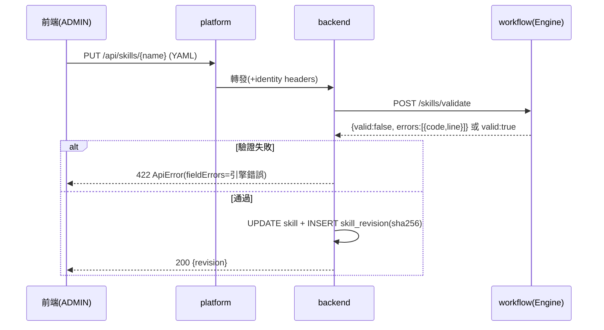
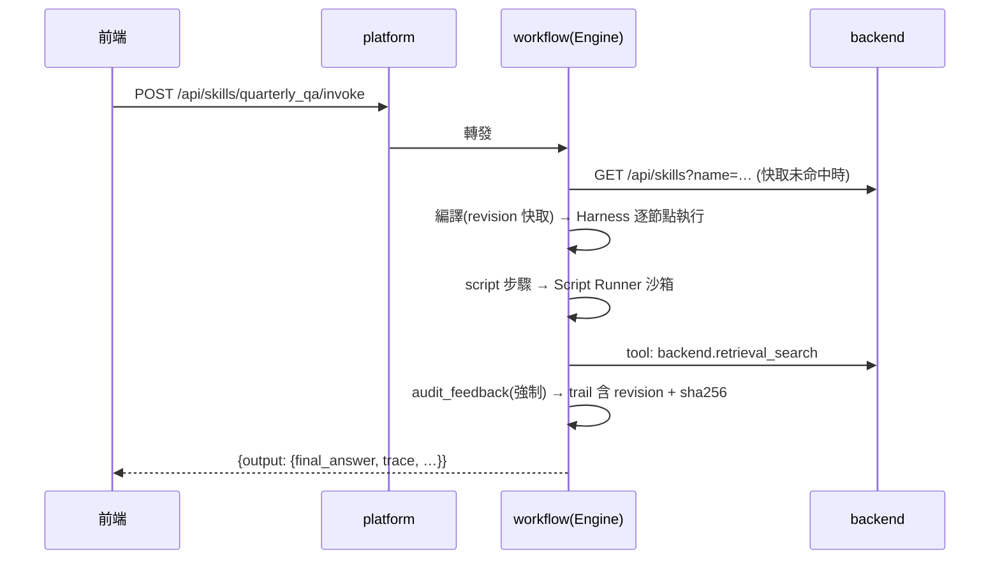

# 設計文稿 — Node-first 架構翻轉 × Skill 流程引擎

> 狀態: **已交付的設計記錄。** 相關文件: [計劃書](01-plan.md)、[規格書](02-spec.md)；目前程式碼與測試入口見 [plans README](../README.md)。
> **歷史草稿警示:** 本文的 `/api/workflows`、`workflows/` 相容層與 Workflows 視圖均屬遷移期設計，不是現行 API 或 UI 契約。
> 內容:架構總覽、程式結構與遷移對照、DB Schema、前後端整合、UI/UX、關鍵資料流。

## 1. 架構總覽

沿用既有信任邊界(服務僅綁 127.0.0.1,服務間 X-Internal-Token + identity headers),不新增對外面向:

```
瀏覽器(JWT, apiFetch)
   ▼
platform :8080
   ├── /api/skills            → backend :8002    (CRUD 代理,新增)
   ├── /api/skills/{n}/invoke → workflow :8001   (執行代理,新增)
   └── /api/workflows         → workflow :8001   (現有)
        ▼
workflow :8001 ─── Engine(Skill → LangGraph 編譯)
   ├── Node Registry(@node:kb_query 10 節點 + retrieve + 後續)
   ├── Harness(traced 泛化:契約驗證/trace/逾時/fatal 短路/Tool 注入)
   ├── Script Runner(v1 in-process 沙箱;ScriptRunnerPort 可換 v2)
   ├── Tool Registry(@tool:http → backend / local → 容器內函式庫)
   └── 內建 skills/*.yaml(kb_query 為首個)
        ▼(自訂 skill 定義按需讀取)
backend :8002 ─── appdb(skill / skill_revision 表)
```

## 2. workflow 服務程式結構與遷移對照

```
workflow/app/
  engine/                      # 新增
    node_registry.py           # @node + NodeSpec(name/version/reads/writes/requires_tools)
    harness.py                 # kbquery/runtime.py 泛化遷入(traced → harnessed)
    skill.py                   # Skill Pydantic schema + 靜態驗證器
    compiler.py                # Skill flow → StateGraph
    expressions.py             # kbquery/calculator.py 擴充:布林/比較條件式
    script_runner.py           # ScriptRunnerPort + RestrictedInProcessRunner(v1)
    tool_registry.py           # @tool + ToolSpec + ToolContext
    state.py                   # 通用 EngineState(保留鍵 + trace/errors reducer)
  nodes/                       # 升級為全域節點家
    retrieve.py                # 現有,補 @node 契約
    kbquery/                   # kb_query 10 節點自 app/kbquery/nodes/ 遷入
  skills/
    kb_query.yaml              # 首個內建 Skill(= 現行手寫圖的宣告式等價物)
  kbquery/                     # 保留:models/ports/adapters/locators(領域契約)
                               # 移除:nodes/、graph.py、routing.py、runtime.py(遷入 engine/)
  workflows/                   # 相容層:@register 舊工作流不動
```

遷移對照(P1):

| 現況                          | 去處                                                                       | 改動量                                                        |
| ----------------------------- | -------------------------------------------------------------------------- | ------------------------------------------------------------- |
| `kbquery/runtime.py traced()` | `engine/harness.py`                                                        | 泛化:加 reads/writes 驗證與 Tool 注入,IMMUTABLE_KEYS 邏輯不變 |
| `kbquery/nodes/*`(10 檔)      | `nodes/kbquery/*`                                                          | 函式本體不改,factory 外補 `@node(...)` 宣告                   |
| `kbquery/graph.py`            | P1 改為以 registry 查節點組圖;P2 被 `skills/kb_query.yaml` + compiler 取代 | 中                                                            |
| `kbquery/calculator.py`       | 留原地;`engine/expressions.py` import 並擴充                               | 小                                                            |
| `kbquery/adapters.py`         | 留原地;P3 以 `@tool` 包裝註冊                                              | 小                                                            |

## 3. DB Schema(appdb / PostgreSQL,Dapper)

演進 [skill-authoring 的 skill 表](../skill-authoring/03-design.md):`flow/logic/script` 三個自由文字欄位收斂為結構化 `definition`,新增 revision 稽核表。

```sql
CREATE TABLE skill (
    id             uuid PRIMARY KEY DEFAULT gen_random_uuid(),
    tenant_id      uuid NOT NULL,
    name           text NOT NULL,                -- ^[a-z][a-z0-9_]{2,63}$
    description    text NOT NULL DEFAULT '',
    required_role  text NOT NULL DEFAULT 'USER', -- USER | ADMIN
    definition     text NOT NULL,                -- Skill YAML 原文(權威格式)
    definition_json jsonb NOT NULL,              -- 正規化 JSON(查詢/驗證用,存檔時由服務轉出)
    current_revision int  NOT NULL DEFAULT 1,
    enabled        boolean NOT NULL DEFAULT true,
    created_by     text NOT NULL,                -- X-User-Id
    created_at     timestamptz NOT NULL DEFAULT now(),
    updated_at     timestamptz NOT NULL DEFAULT now(),
    CONSTRAINT uq_skill_tenant_name UNIQUE (tenant_id, name)
);

-- 稽核與回溯:每次 PUT 產生一筆;invoke 記錄引用的 revision
CREATE TABLE skill_revision (
    id             uuid PRIMARY KEY DEFAULT gen_random_uuid(),
    skill_id       uuid NOT NULL REFERENCES skill(id),
    revision       int  NOT NULL,
    definition     text NOT NULL,                -- 該版 YAML 原文(script 原文含在內)
    definition_sha256 text NOT NULL,             -- 對應 audit trail 中的 hash
    created_by     text NOT NULL,
    created_at     timestamptz NOT NULL DEFAULT now(),
    CONSTRAINT uq_skill_revision UNIQUE (skill_id, revision)
);

CREATE INDEX ix_skill_tenant ON skill(tenant_id) WHERE enabled;
CREATE INDEX ix_skill_revision_skill ON skill_revision(skill_id);
```

設計要點:

- **軟刪**:`DELETE` = `enabled=false`;revision 永不刪(金融稽核)。
- **hash 鏈**:audit trail 記 `skill_name + revision + definition_sha256`,可回查當次執行用的確切定義與 script 原文。
- 內建 skill(repo 檔案)不入 DB;清單 API 由 workflow 服務合併兩來源。
- 節點目錄不入 DB(程式即事實來源,`GET /nodes` 即時反映)。
- 本 schema 同時是 skill-authoring P2(CRUD + 匯出)的資料表;該計畫不另建 `flow/logic/script` 三欄位表。

## 4. 後端整合

### 4.1 backend(:8002)— Skill CRUD(feature folder:`Features/Skills/`)

- Dapper + 上表;所有查詢帶 `tenant_id`(identity headers)。
- `POST/PUT` 流程:解析 YAML → 呼叫 workflow `POST /skills/validate` 做引擎級驗證(unknown_node/unbounded_loop/forbidden_script…)→ 通過才寫入並 bump revision。backend 不自己實作驗證邏輯,**驗證的唯一事實來源是引擎**。
- 錯誤格式沿用 ApiError;驗證失敗 → 422,`fieldErrors` 帶引擎錯誤碼清單。

**依賴方向取捨**:backend → workflow 的 validate 呼叫使兩服務互相依賴(現況僅 workflow → backend 單向),帶來啟動順序與部署耦合。曾評估由 platform 編排(先打 workflow validate、通過再打 backend 儲存)以保持單向依賴,但會把「驗證後才可寫入」的不變式分散到 platform,選擇維持 backend → workflow:驗證的唯一事實來源留在引擎,耦合代價以 validate 端點無副作用、失敗即快速回 422 緩解。

### 4.2 workflow(:8001)

- `GET /skills`:內建(啟動時載入 `skills/*.yaml`)+ 自訂(向 backend `GET /api/skills` 帶租戶標頭取回、依 revision 快取編譯結果)。
- `POST /skills/{name}/invoke`:名稱先查內建、再查自訂;404/403/422/504/500 錯誤碼與 `/workflows/{name}/invoke` 完全一致,前端可共用呼叫程式。
- `POST /skills/validate`:無副作用,供 backend 與前端編輯器使用。

### 4.3 platform(:8080)

- `SkillsController`:`/api/skills*` CRUD → BackendClient 轉發;`/api/skills/{name}/invoke` → 既有 WorkflowClient 模式轉發 workflow。
- JWT 驗證後帶 identity headers 下傳;ADMIN 判斷由 backend/workflow 做(與 Config PUT 同模式)。

## 5. 前端整合與 UI/UX

### 5.1 資訊架構

現有五視圖(Chat/Documents/Workflows/Analysis/Config)中,**Workflows 視圖擴充為「Workflows & Skills」**,不新增頂層視圖:

```
Workflows & Skills
├── Tab 1:執行(現有工作流清單 + skill 清單合併,標示來源徽章 builtin/custom/code)
├── Tab 2:Skill 管理(ADMIN 可見):清單 + 編輯器
└── Tab 3:節點目錄(唯讀):GET /nodes 的契約瀏覽
```

### 5.2 主要畫面(wireframe)

**Skill 清單(Tab 2)**

```
┌ Skills ──────────────────────────────── [＋ 新增 Skill] ┐
│ 名稱          描述              角色   rev  狀態   操作   │
│ kb_query      可驗證知識查詢    USER   內建  —     [檢視] │
│ quarterly_qa  季報問答          USER   r3   啟用   [編輯][停用][歷史] │
└──────────────────────────────────────────────────────────┘
```

**Skill 編輯器**(核心畫面,三欄):

```
┌ 編輯 quarterly_qa ──────────────────────────── [驗證][儲存] ┐
│ ┌ 節點目錄 ────┐ ┌ YAML 編輯器 ──────────┐ ┌ 驗證結果 ────┐ │
│ │ 🔍 搜尋節點   │ │ name: quarterly_qa    │ │ ✅ 節點引用   │ │
│ │ ▸ query_intake│ │ flow:                 │ │ ✅ loop 上限  │ │
│ │   reads: ...  │ │   - node: query_intake│ │ ⚠ dataflow:  │ │
│ │   writes: ... │ │   - loop:             │ │   answer 讀了 │ │
│ │ ▸ retrieval_… │ │       max_iterations:2│ │   未產出的鍵  │ │
│ │  (點擊插入)    │ │       ...             │ │ ❌ script 第3行│ │
│ └───────────────┘ └───────────────────────┘ │   禁用 import │ │
│                                             └───────────────┘ │
└────────────────────────────────────────────────────────────────┘
```

- 左欄 = `GET /nodes` 節點目錄(含 reads/writes 契約,點擊插入 YAML 樣板)。
- 中欄 = YAML 文字編輯器(v1 純 textarea + 語法高亮即可;拖拉式視覺編輯器為未來項,YAGNI)。
- 右欄 = `POST /skills/validate` 即時結果(debounce 800ms),錯誤碼對應人話訊息。

**執行與 Trace 檢視**(Tab 1 點入):

```
┌ 執行 kb_query ─────────────────────────────────────────┐
│ query: [2025Q3 稅後淨利是多少？        ] [執行]          │
│ ── 結果 ────────────────────────────────────────────── │
│ answer_mode: ANSWER   verification: PASS   attempts: 1 │
│ 【結論】稅後淨利 2025Q3 為 1,234 百萬元 …               │
│ ── 節點軌跡(trace)──────────────────────────────────── │
│ ● query_intake        3ms   ok                          │
│ ● query_rewrite     412ms   ok    (llm: gpt-4o-mini)    │
│ ● …                                                     │
│ ● evidence_verification 2ms ok → PASS                   │
│   └ 展開:input/output 鍵名摘要、failure_codes           │
└─────────────────────────────────────────────────────────┘
```

trace 資料即 invoke 回應 `output.trace`(現成,不需新 API);每列可展開 TraceEntry 欄位。

### 5.3 UX 原則

- USER 只看得到 Tab 1(執行);Tab 2/3 依 localStorage 的 role 顯示,後端仍做最終權限判斷。
- 驗證錯誤永遠指到 YAML 行號(引擎驗證器回 `line` 欄位)。
- 停用/儲存等破壞性操作用既有 toast + confirm 模式;歷史(revision)以唯讀 diff 呈現(v1 純文字對照即可)。
- 前端一律走既有 `apiFetch`(401 自動登出等行為沿用)。

## 6. 關鍵資料流(sequence)

**建立/更新 Skill**



**執行 Skill(含 script 步驟)**



## 7. 開放問題(進 P4 前需拍板)

1. 自訂 Skill 的執行紀錄(audit trail)是否也要落 appdb 供前端查歷史?(現為 logging;若要查詢介面,P4 需加 `skill_run` 表——建議先不做,logging + Langfuse 已可稽核。)
2. Skill 編輯器是否需要「試跑(dry-run)」模式(用假輸入走全圖但 tool 全 mock)?建議 P4 之後再議。
3. 舊 4 個 code workflow 遷移為內建 skill 的時點(D4 目前為選配)。
